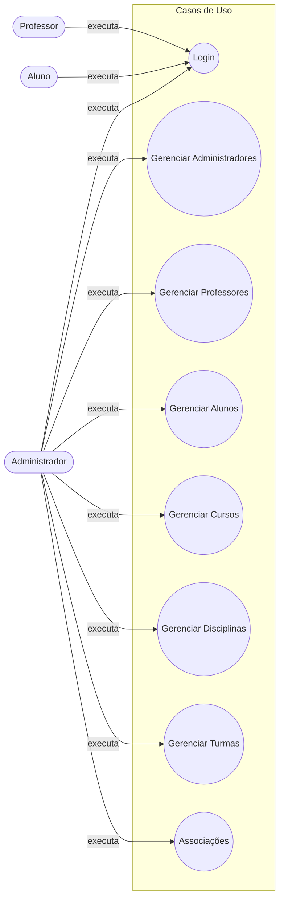
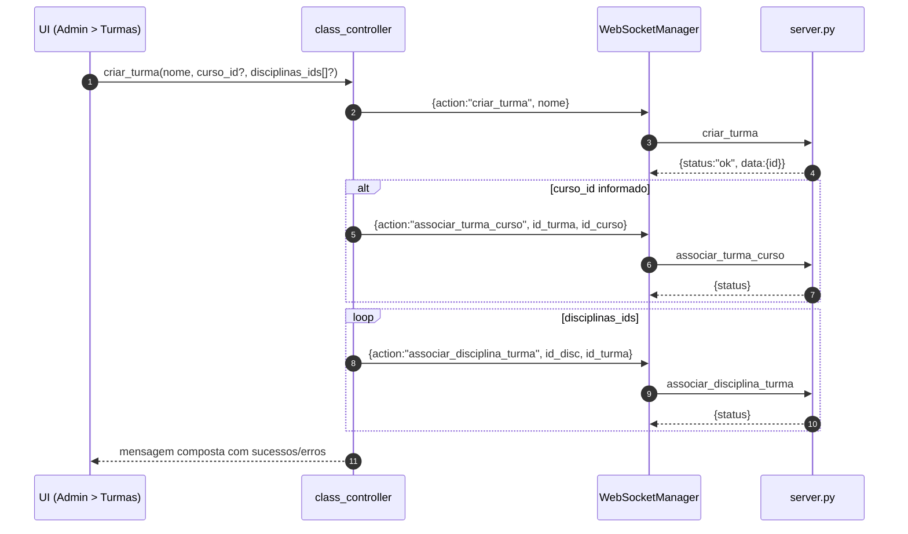

# Sistema Educacional — Documentação

Este documento descreve a arquitetura, dados, fluxos e API do sistema educacional localizado em `sistema-educacional/`. Inclui diagramas Mermaid (renderizam no GitHub e VS Code) para casos de uso, relações de dados e fluxos principais.

## Visão geral

- Cliente desktop em Python usando CustomTkinter (UI)
- Comunicação via WebSocket (JSON) entre cliente e servidor
- Servidor Python gerencia ações e persiste dados
- Persistência em arquivos JSON, acessados via módulo C++ exposto como DLL no Windows

Principais recursos (admin):
- Autenticação de usuários
- Cadastro/listagem de Administradores, Professores, Alunos
- Cadastro de Cursos, Disciplinas, Turmas
- Associações: Disciplina↔Curso, Professor↔Disciplina, Turma↔Curso, Aluno↔Turma, Disciplina↔Turma

## Arquitetura do sistema

```mermaid
flowchart LR
    subgraph UI[Cliente Desktop (CustomTkinter)]
      LV[view/login_view.py]
      AD[view/admin/dashboard.py + tabs/*]
      CTRL[controller/*]
    end

    WSM[controller/websocket_manager.py\n(WebSocket cliente)]

    subgraph S[Servidor Python]
      SVR[server.py\n(WebsocketServer)]
      HANDLERS[Handlers de ações]
    end

    subgraph M[Model / Persistência]
      DA_PY[model/data_access.py]
      DA_DLL[cpp_modules/libdata_access.dll]
      JSON[(data/*.json)]
    end

    LV --> CTRL
    AD --> CTRL
    CTRL --> WSM --> SVR
    SVR --> HANDLERS --> DA_PY --> DA_DLL --> JSON
```

## Atores e casos de uso (alto nível)



Observação: As telas de Professor/Aluno ainda são básicas (pós-login); a gestão efetiva é centrada no papel de Administrador.

## Modelo de dados (Entidades e relações)

Arquivos JSON:
- `data/usuarios.json`
- `data/cursos.json`
- `data/disciplinas.json`
- `data/turmas.json`

```mermaid
erDiagram
  USUARIO {
    string id
    string username
    string password
    string nome
    string sobrenome
    string role  // admin | professor | aluno
  }

  CURSO {
    string id
    string nome
    string[] disciplinas // lista de ids
  }

  DISCIPLINA {
    string id
    string nome
    string professor_id // -> USUARIO.id (professor)
    string curso_id     // -> CURSO.id
  }

  TURMA {
    string id
    string nome
    string curso_id      // -> CURSO.id
    string[] alunos      // lista de USUARIO.id (aluno)
    string[] disciplinas // lista de DISCIPLINA.id
  }

  USUARIO ||--o{ DISCIPLINA : "leciona (professor_id)"
  CURSO ||--o{ DISCIPLINA : "possui"
  CURSO ||--o{ TURMA : "agrupa"
  USUARIO ||--o{ TURMA : "frequenta (aluno via lista)"
  TURMA }o--o{ DISCIPLINA : "tem"
```

Notas:
- IDs são strings numéricas geradas aleatoriamente (`model/data_access.py::gerar_id`).
- Senhas são armazenadas em texto puro (apenas para fins didáticos; ver seção Segurança).

## Fluxos principais

### Fluxo de Login

```mermaid
sequenceDiagram
  autonumber
  participant UI as UI (login_view)
  participant CTRL as login_controller
  participant WSM as WebSocketManager
  participant SVR as server.py
  participant DA as model/data_access.py
  participant JSON as data/usuarios.json

  UI->>CTRL: tentar_login(usuario, senha)
  CTRL->>WSM: send({action:"login", username, password})
  WSM->>SVR: mensagem JSON via WebSocket
  SVR->>DA: autenticar_usuario(username, password)
  DA->>JSON: ler usuários
  DA-->>SVR: usuário ou None
  SVR-->>WSM: {status, message, user?}
  WSM-->>CTRL: resposta
  CTRL-->>UI: sucesso/erro; redireciona por role
```

### Fluxo: Criar Turma e associar Curso/Disciplinas



## API (WebSocket JSON)

- Protocolo: WebSocket
- URL: definida por `WEBSOCKET_URL` em `.env` do cliente (ex.: `ws://localhost:8080`)
- Formato: mensagens JSON com `action` e campos específicos

Ações suportadas pelo servidor (`server.py`):

- Autenticação
  - `login` → req: {username, password} | resp: {status, message, user?}
- Cadastro
  - `cadastrar_admin` → {nome, sobrenome, email, senha}
  - `cadastrar_aluno` → {nome, sobrenome, email, senha}
  - `cadastrar_professor` → {nome, sobrenome, email, senha}
  - `cadastrar_curso` → {nome}
  - `cadastrar_disciplina` → {nome}
  - `criar_turma` → {nome}
- Listagem
  - `listar_admins` | `listar_alunos` | `listar_professores`
  - `listar_cursos` | `listar_disciplinas` | `listar_turmas`
- Associações
  - `associar_disciplina_curso` → {id_disciplina, id_curso}
  - `atribuir_professor_disciplina` → {id_professor, id_disciplina}
  - `associar_turma_curso` → {id_turma, id_curso}
  - `atribuir_aluno_turma` → {id_aluno, id_turma}
  - `associar_disciplina_turma` → {id_disciplina, id_turma}

Padrão de resposta:
- Sucesso: `{ "status": "ok", "message"?: string, "data"?: any }`
- Erro: `{ "status": "error", "message": string }`

## Módulos principais

- UI (CustomTkinter)
  - `view/login_view.py`: tela de login (async via thread + spinner)
  - `view/admin/dashboard.py` e `view/admin/tabs/*`: CRUD/associações
- Controllers (cliente)
  - `controller/*_controller.py`: validam inputs, montam mensagens, interpretam respostas, exibem mensagens para UI
  - `controller/websocket_manager.py`: singleton de conexão WebSocket, leitura `.env` (`WEBSOCKET_URL`)
- Servidor
  - `server.py`: mapeia `action` → handler; serializa respostas; roda `websocket_server` na porta 8080
- Model/Persistência
  - `model/data_access.py`: carrega/salva JSON via `libdata_access.dll` (C++)
  - `cpp_modules/libdata_access.dll`: implementação nativa de IO dos JSON
  - `data/*.json`: dados persistidos

## Configuração e execução

Pré-requisitos:
- Windows (DLL fornecida: `cpp_modules/libdata_access.dll`)
- Python 3.10+

Instalação de dependências (na pasta `sistema-educacional/`):

```powershell
pip install -r requirements.txt
```

Configurar o cliente para apontar ao servidor local:
- Crie/edite `sistema-educacional/.env` com:
  - `WEBSOCKET_URL=ws://localhost:8080`

Executar servidor (WebSocket, porta 8080):

```powershell
python sistema-educacional/server.py
```

Executar cliente (UI):

```powershell
python sistema-educacional/client.py
```

## Segurança e limitações

- Senhas são armazenadas em texto puro nos JSON (apenas fins didáticos). Recomendações:
  - Usar hashing (bcrypt/argon2) e sal
  - Trocar WebSocket para WSS com TLS em produção
- Não há autenticação por sessão/token; cliente confia na resposta de login
- IDs randômicos simples podem colidir em grandes volumes (probabilidade baixa, mas possível)
- Não há validação forte de permissão no servidor (comentada em `handle_cadastrar_admin`) — reforçar RBAC

## Próximos passos sugeridos

- Adicionar hashing de senha e tokens de sessão
- Consolidar endpoint de criação de turma (permitir curso e disciplinas na mesma requisição)
- Padrão de validação e mensagens internacionalizadas
- Testes automatizados (unit/integration) para handlers e controllers
- Migração futura de JSON para um banco relacional (SQLite/PostgreSQL)

---

Seções de código relevantes:
- Servidor: `sistema-educacional/server.py`
- Cliente: `sistema-educacional/client.py`
- Controllers: `sistema-educacional/controller/*.py`
- UI: `sistema-educacional/view/*`
- Modelo: `sistema-educacional/model/data_access.py`
- Dados: `sistema-educacional/data/*.json`
