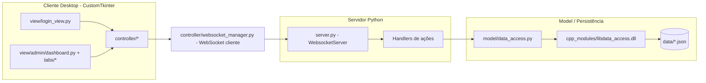
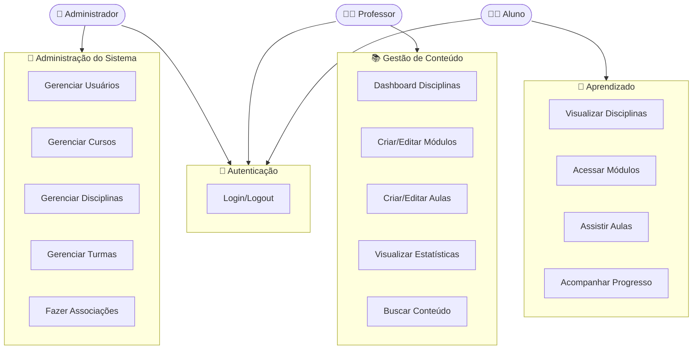
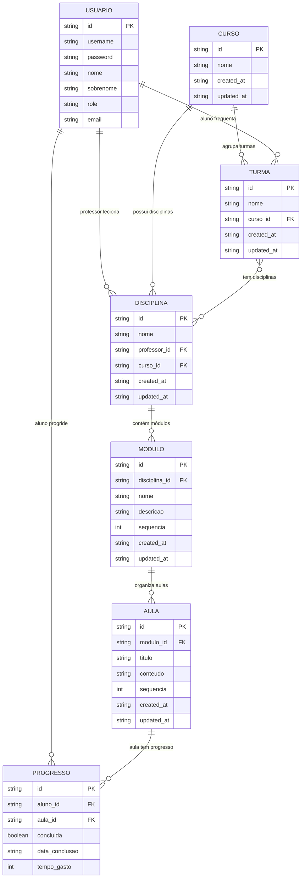
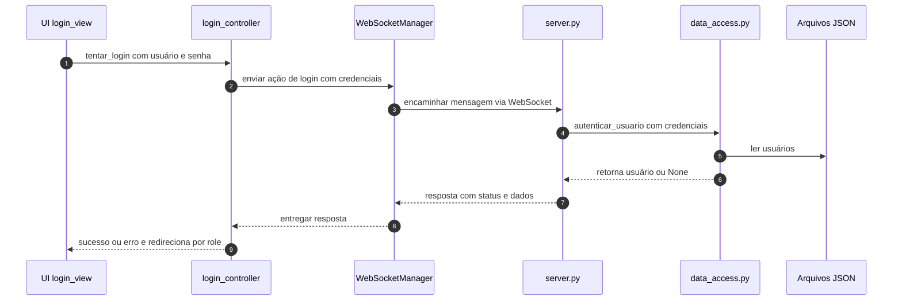
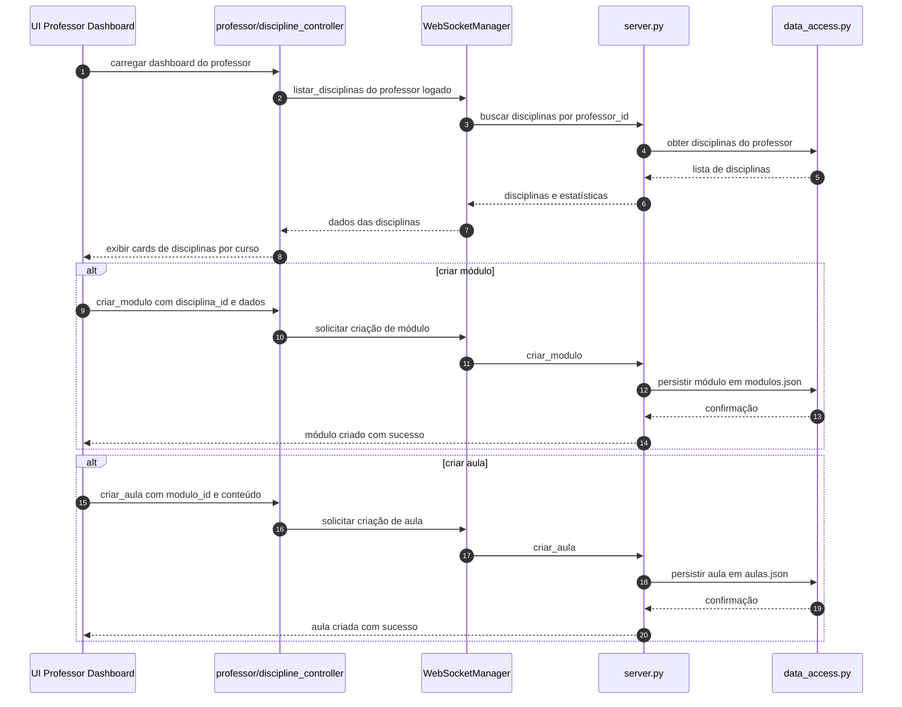
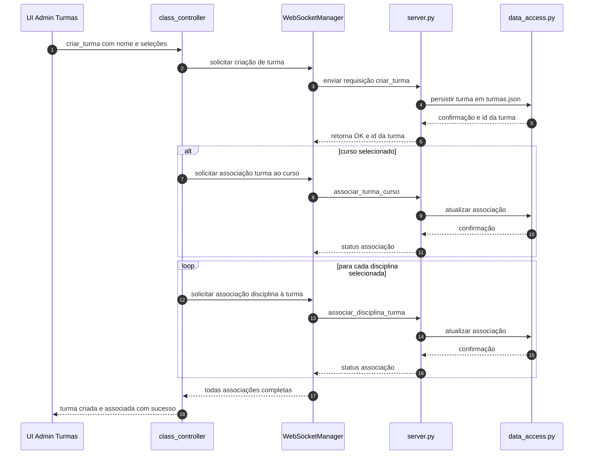
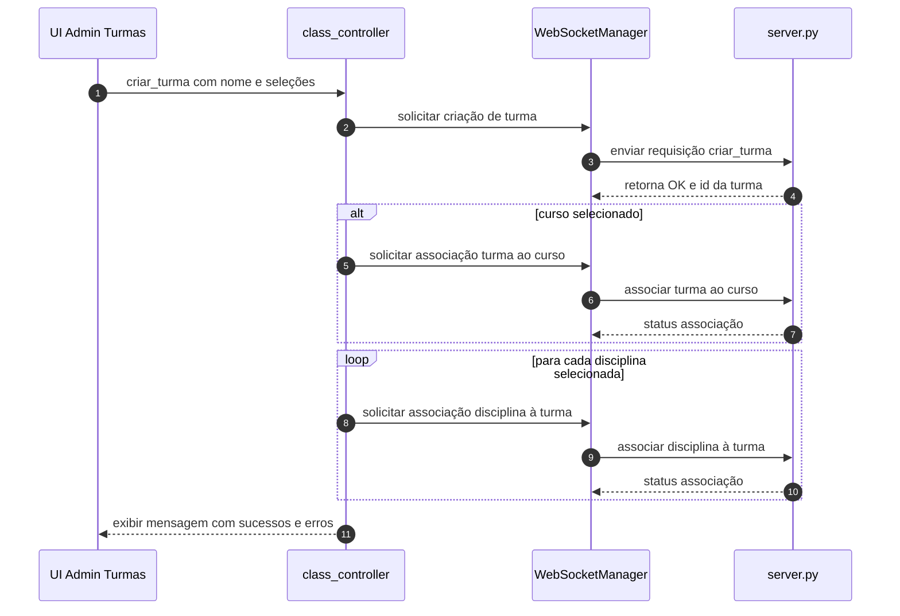
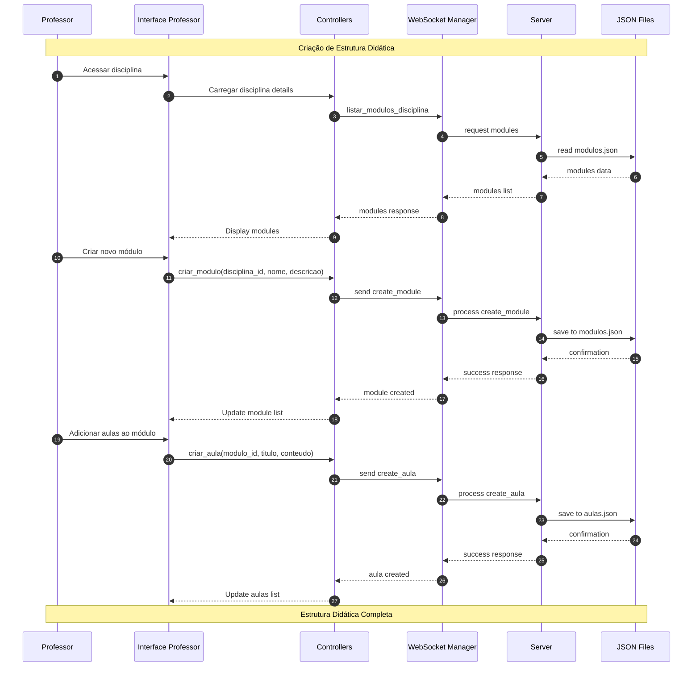

# Sistema Educacional — Documentação

Este documento descreve a arquitetura, dados, fluxos e API do sistema educacional localizado em `sistema-educacional/`. Inclui diagramas Mermaid (renderizam no GitHub e VS Code) para casos de uso, relações de dados e fluxos principais.

## Visão geral

- Cliente desktop em Python usando CustomTkinter (UI)
- Comunicação via WebSocket (JSON) entre cliente e servidor
- Servidor Python gerencia ações e persiste dados
- Persistência em arquivos JSON, acessados via módulo C++ exposto como DLL no Windows

Principais recursos (admin):
- Autenticação de usuários
- Cadastro/listagem de Administradores, Professores, Alunos
- Cadastro de Cursos, Disciplinas, Turmas
- Associações: Disciplina↔Curso, Professor↔Disciplina, Turma↔Curso, Aluno↔Turma, Disciplina↔Turma

## Arquitetura do sistema



## Atores e casos de uso (alto nível)



**Status de Implementação:**
- ✅ **Administração**: Totalmente implementada
- ✅ **Professor**: Totalmente implementada  
- ✅ **Aluno**: Totalmente implementada

### Resumo das Funcionalidades

| Ator | Principais Responsabilidades | Status |
|------|----------------------------|---------|
| 👤 **Administrador** | • Cadastro de usuários (admin, professor, aluno)<br>• Gestão de cursos, disciplinas e turmas<br>• Associações entre entidades<br>• Controle total do sistema | ✅ Implementado |
| 👨‍🏫 **Professor** | • Dashboard com disciplinas atribuídas<br>• Criação de módulos didáticos<br>• Desenvolvimento de aulas<br>• Estatísticas de conteúdo | ✅ Implementado |
| 👨‍🎓 **Aluno** | • Dashboard com disciplinas matriculadas<br>• Visualização de módulos e aulas<br>• Acompanhamento de progresso<br>• Controle de conclusão de aulas | ✅ Implementado |

## Modelo de dados (Entidades e relações)

Arquivos JSON:
- `data/usuarios.json`
- `data/cursos.json`
- `data/disciplinas.json`
- `data/turmas.json`
- `data/modulos.json`
- `data/aulas.json`
- `data/progresso.json`



Notas:
- IDs são strings numéricas geradas aleatoriamente (`model/data_access.py::gerar_id`).
- Senhas são armazenadas em texto puro (apenas para fins didáticos; ver seção Segurança).

## Fluxos principais

### Fluxo de Login



### Fluxo: Dashboard do Professor e Gestão de Conteúdo



### Fluxo: Criar Turma e associar Curso/Disciplinas





### Fluxo: Gestão Completa de Conteúdo Didático



## API (WebSocket JSON)

- Protocolo: WebSocket
- URL: definida por `WEBSOCKET_URL` em `.env` do cliente (ex.: `ws://localhost:8080`)
- Formato: mensagens JSON com `action` e campos específicos

Ações suportadas pelo servidor (`server.py`):

- Autenticação
  - `login` → req: {username, password} | resp: {status, message, user?}
- Cadastro
  - `cadastrar_admin` → {nome, sobrenome, email, senha}
  - `cadastrar_aluno` → {nome, sobrenome, email, senha}
  - `cadastrar_professor` → {nome, sobrenome, email, senha}
  - `cadastrar_curso` → {nome}
  - `cadastrar_disciplina` → {nome}
  - `criar_turma` → {nome}
- Listagem
  - `listar_admins` | `listar_alunos` | `listar_professores`
  - `listar_cursos` | `listar_disciplinas` | `listar_turmas`
- Gestão de Conteúdo Didático
  - `listar_modulos` | `listar_modulos_disciplina` → {disciplina_id?}
  - `criar_modulo` → {disciplina_id, nome, descricao?, ordem?}
  - `editar_modulo` → {id, nome?, descricao?, ordem?}
  - `excluir_modulo` → {id}
  - `listar_aulas` | `listar_aulas_modulo` → {modulo_id?}
  - `criar_aula` → {modulo_id, titulo, resumo, video_url?, ordem?}
  - `editar_aula` → {id, titulo?, resumo?, video_url?, ordem?}
  - `excluir_aula` → {id}
- Associações
  - `associar_disciplina_curso` → {id_disciplina, id_curso}
  - `atribuir_professor_disciplina` → {id_professor, id_disciplina}
  - `associar_turma_curso` → {id_turma, id_curso}
  - `atribuir_aluno_turma` → {id_aluno, id_turma}
  - `associar_disciplina_turma` → {id_disciplina, id_turma}
- Funcionalidades do Aluno
  - `listar_disciplinas_aluno` → {aluno_id}
  - `obter_progresso_aluno` → {aluno_id, disciplina_id?}
  - `marcar_aula_concluida` → {aluno_id, aula_id}
  - `obter_estatisticas_aluno` → {aluno_id}
  - `buscar_conteudo_aluno` → {aluno_id, termo_busca}

Padrão de resposta:
- Sucesso: `{ "status": "ok", "message"?: string, "data"?: any }`
- Erro: `{ "status": "error", "message": string }`

## Módulos principais

- UI (CustomTkinter)
  - `view/login_view.py`: tela de login (async via thread + spinner)
  - `view/admin/dashboard.py` e `view/admin/tabs/*`: CRUD/associações administrativas
  - `view/professor/dashboard.py`: interface do professor com gestão de disciplinas
  - `view/professor/discipline_management.py`: gerenciamento de conteúdo didático
  - `view/professor/components/*`: componentes especializados (stats, busca, dialogs, cards de disciplinas)
- Controllers (cliente)
  - `controller/*_controller.py`: validam inputs, montam mensagens, interpretam respostas, exibem mensagens para UI
    - `admin_controller.py`: operações administrativas gerais
    - `course_controller.py`: gestão de cursos
    - `discipline_controller.py`: gestão de disciplinas
    - `student_controller.py`: gestão de alunos
    - `professor_controller.py`: gestão de professores
    - `class_controller.py`: gestão de turmas
    - `modulo_controller.py`: gestão de módulos didáticos
    - `aula_controller.py`: gestão de aulas
    - `login_controller.py`: autenticação
  - `controller/websocket_manager.py`: singleton de conexão WebSocket, leitura `.env` (`WEBSOCKET_URL`)
- Servidor
  - `server.py`: mapeia `action` → handler; serializa respostas; roda `websocket_server` na porta 8080
- Model/Persistência
  - `model/data_access.py`: carrega/salva JSON via `libdata_access.dll` (C++)
  - `cpp_modules/libdata_access.dll`: implementação nativa de IO dos JSON
  - `data/*.json`: dados persistidos (usuarios, cursos, disciplinas, turmas, modulos, aulas, progresso)
- Sessão
  - `session.py`: gerenciamento de estado da sessão do usuário logado

### Detalhamento da Interface do Professor

A interface do professor representa um dos módulos mais complexos do sistema, oferecendo funcionalidades especializadas para gestão de conteúdo didático:

#### Dashboard Principal (`view/professor/dashboard.py`)
- **Lista de Disciplinas**: Exibe todas as disciplinas atribuídas ao professor em formato de cards visuais
- **Estatísticas por Disciplina**: Cada card mostra métricas como número de módulos, aulas e status de desenvolvimento
- **Ações Rápidas**: Botões para criar, editar, visualizar e gerenciar conteúdo de cada disciplina
- **Sistema de Busca**: Filtros por nome da disciplina e status de desenvolvimento

#### Gestão de Conteúdo (`view/professor/discipline_management.py`)
- **CRUD de Módulos**: Interface para criação, edição e exclusão de módulos didáticos
- **CRUD de Aulas**: Gestão de aulas dentro de cada módulo com validação de sequência
- **Validação de Campos**: Sistema robusto de validação para garantir integridade dos dados
- **Feedback Visual**: Mensagens de sucesso/erro para todas as operações

#### Componentes Especializados (`view/professor/components/`)
- `stats_widget.py`: Widget customizado para exibição de estatísticas
- `search_filter.py`: Componente de busca e filtros avançados
- `dialogs.py`: Diálogos modais padronizados para operações CRUD
- `discipline_components.py`: Cards informativos de disciplinas
- `modulo_components.py`: Interface de gestão de módulos e aulas

### Detalhamento da Interface do Aluno

A interface do aluno foi implementada para proporcionar uma experiência de aprendizado completa e intuitiva:

#### Dashboard Principal (`view/student/dashboard.py`)
- **Portal Personalizado**: Exibe informações do aluno e progresso acadêmico geral
- **Lista de Disciplinas**: Cards visuais das disciplinas em que o aluno está matriculado
- **Widget de Progresso**: Estatísticas em tempo real (total, concluídas, em andamento, não iniciadas)
- **Sistema de Busca e Filtros**: Localização rápida de disciplinas por nome ou status de progresso

#### Visualizador de Módulos (`view/student/components/module_viewer.py`)
- **Navegação Estruturada**: Interface organizada com sidebar para módulos e área de conteúdo para aulas
- **Visualização de Aulas**: Conteúdo expandível com texto completo das aulas
- **Controle de Progresso**: Botões para marcar aulas como concluídas
- **Informações Contextuais**: Dados do professor, curso e estatísticas de cada disciplina

#### Componentes do Aluno (`view/student/components/`)
- `discipline_card.py`: Cards informativos com progresso visual por disciplina
- `progress_widget.py`: Dashboard de estatísticas acadêmicas
- `search_filter.py`: Sistema de busca e filtros por status de progresso
- `module_viewer.py`: Interface completa para consumo de conteúdo educacional

### Controladores de Conteúdo

#### Módulo Controller (`controller/modulo_controller.py`)
Responsável por operações relacionadas a módulos didáticos:
- `criar_modulo()`: Criação de novos módulos com validação
- `listar_modulos_disciplina()`: Listagem de módulos por disciplina
- `atualizar_modulo()`: Edição de módulos existentes
- `excluir_modulo()`: Remoção de módulos com verificação de dependências

#### Aula Controller (`controller/aula_controller.py`)
Gerencia operações de aulas:
- `criar_aula()`: Criação de aulas com associação a módulos
- `listar_aulas_modulo()`: Listagem de aulas por módulo
- `atualizar_aula()`: Edição de conteúdo de aulas
- `excluir_aula()`: Remoção de aulas

### Estruturas de Dados

#### Módulos (`data/modulos.json`)
Estrutura para armazenamento de módulos didáticos:
```json
{
  "id": "string",
  "disciplina_id": "string", 
  "nome": "string",
  "descricao": "string",
  "sequencia": "number",
  "created_at": "timestamp",
  "updated_at": "timestamp"
}
```

#### Aulas (`data/aulas.json`)
Estrutura para armazenamento de aulas:
```json
{
  "id": "string",
  "modulo_id": "string",
  "titulo": "string", 
  "conteudo": "string",
  "sequencia": "number",
  "created_at": "timestamp",
  "updated_at": "timestamp"
}
```

## Configuração e execução

Pré-requisitos:
- Windows (DLL fornecida: `cpp_modules/libdata_access.dll`)
- Python 3.10+

Instalação de dependências (na pasta `sistema-educacional/`):

```powershell
pip install -r requirements.txt
```

Configurar o cliente para apontar ao servidor local:
- Crie/edite `sistema-educacional/.env` com:
  - `WEBSOCKET_URL=ws://localhost:8080`

Executar servidor (WebSocket, porta 8080):

```powershell
python sistema-educacional/server.py
```

Executar cliente (UI):

```powershell
python sistema-educacional/client.py
```

## Segurança e limitações

- Senhas são armazenadas em texto puro nos JSON (apenas fins didáticos). Recomendações:
  - Usar hashing (bcrypt/argon2) e sal
  - Trocar WebSocket para WSS com TLS em produção
- Não há autenticação por sessão/token; cliente confia na resposta de login
- IDs randômicos simples podem colidir em grandes volumes (probabilidade baixa, mas possível)
- Não há validação forte de permissão no servidor (comentada em `handle_cadastrar_admin`) — reforçar RBAC

## Próximos passos sugeridos

- Adicionar hashing de senha e tokens de sessão
- Consolidar endpoint de criação de turma (permitir curso e disciplinas na mesma requisição)
- Padrão de validação e mensagens internacionalizadas
- Testes automatizados (unit/integration) para handlers e controllers
- Migração futura de JSON para um banco relacional (SQLite/PostgreSQL)

---

Seções de código relevantes:
- Servidor: `sistema-educacional/server.py`
- Cliente: `sistema-educacional/client.py`
- Controllers: `sistema-educacional/controller/*.py`
- UI: `sistema-educacional/view/*`
- Modelo: `sistema-educacional/model/data_access.py`
- Dados: `sistema-educacional/data/*.json`
